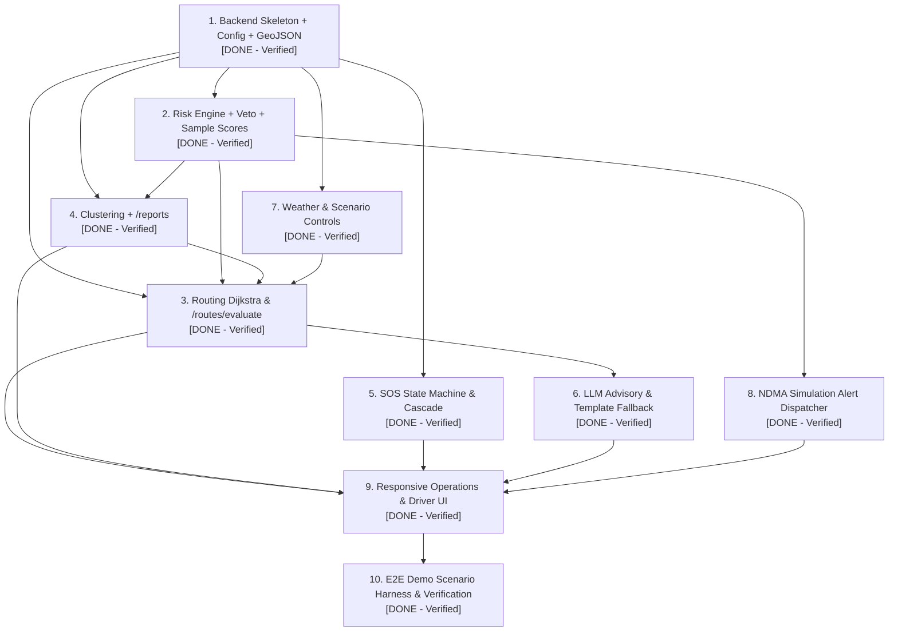

# MargSetu Dependency-Ordered Build Checklist
**Project:** MargSetu — Highway Corridor Decision Support & Disaster Alert System  
**PRD Reference:** PRD v2.0 §9 (Build Order) & §11 (Acceptance Criteria)  
**Status:** Living Checklist — Progressively tracked per build milestone  
**Last Updated:** 2026-09-20  

---

## 1. Overview & Dependency Graph

Development proceeds strictly in topological order. A component may not begin until its declared prerequisites are completed and pass their respective acceptance checks.

---

## 2. Structured Build Order Items

### Module 1: Project Scaffolding, Backend Foundation & Living Documentation
* **Status:** `DONE` (Completed & Verified: 2026-09-19)
* **PRD Reference:** PRD §9 Item 1 (Backend skeleton + config.json + corridor GeoJSON -> GET /health)
* **Prerequisites:** Explicit User Approval (Granted via CR-001 & CR-002)
* **Target Artifacts:**
  - `ARCHITECTURE.md`, `WORKFLOW.md`, `BUILD_ORDER.md`, `DEBUG_CHECKLIST.md`
  - `backend/main.py` (FastAPI app, CORS, lifespan, GET /health endpoint)
  - `backend/models/` (`enums.py`, `corridor.py`, `config.py`, `incident.py`, `sos.py`)
  - `backend/services/` (`config_service.py`, `corridor_service.py`, `sos_service.py`)
  - `backend/data/corridors.geojson` (C1 Guwahati-Silchar via Sonapur Tunnel 25.1147°N, 92.3654°E, C2 Haflong Bypass, C3 Siliguri-Guwahati)
  - `backend/data/config.json` (PRD §3 seasonal risk weights, vehicle modifiers, veto thresholds, fuel/carbon parameters)
  - `backend/tests/` (11/11 tests passing in 0.05s)
* **Acceptance Check (AC-1, AC-3, AC-4):**
  - All 4 living documents exist in root with complete specs and Rule 1 audit logging.
  - `GET /health` returns HTTP 200 OK: `status="healthy"`, `service="MargSetu Core Engine"`, `version="2.0.0"`, `authority="NDMA"`, `disclaimer="SIMULATION — not connected to official NDMA systems"`, `honesty_label="VERIFIED STATIC"`, 3 corridors loaded, config loaded.
  - Pytest suite passes 11/11 tests (`test_health.py` 6/6, `test_services.py` 5/5).
  - Authority & Honesty Audit: NDMA is strictly the ONLY authority named (zero mentions of NDRF, SDRF, NHAI, BRO, Police; zero claims of "rescued"; `is_dispatched=False` strictly enforced). Audited and certified by `qa-demo`.

---

### Module 2: Environmental Risk Scoring Engine, Veto Gates & Honesty Contracts
* **Status:** `DONE` (Completed & Verified: 2026-09-19)
* **PRD Reference:** PRD §9 Item 2 (Risk engine + veto + unit-tested sample scores)
* **Prerequisites:** Module 1
* **Target Artifacts:**
  - `backend/services/risk_engine.py` (Multi-factor segment risk $R_i$, hard veto gates, seasonal weight loading, vehicle modifiers, exponential edge cost)
  - `backend/models/risk.py` (`SegmentRiskBreakdown`, `RiskFactorScore`, `VehicleType`, `SeasonalWeights`, `RiskClassification`, `ColorState`)
  - `backend/models/enums.py` (`HonestyLabel`, `CorridorStatus`, `HazardType`)
  - `backend/tests/test_risk_engine.py` (10/10 mandated unit test cases passing)
* **Acceptance Check (AC-2, AC-3, AC-5):**
  - Pytest passes 21/21 tests in 0.05s (10/10 in `test_risk_engine.py`, 6/6 in `test_health.py`, 5/5 in `test_services.py`).
  - All 10 mandated criteria verified:
    1. Baseline dry condition Green ($R_i = 1.20 < 4.0$).
    2. Moderate rain/slope Amber ($R_i = 4.50 \in [4.0, 6.0]$).
    3. Severe conditions Red ($R_i = 7.65 > 6.0$).
    4. Hard veto compound hazard: Extreme rain (>75mm) + steep slope (>30°) $\rightarrow$ `is_blocked=True`, cost = $\infty$, `dark_red` (commercial) / `purple` (emergency).
    5. Hard veto crowd incidents: $\ge 3$ corroborated reports $\rightarrow$ `is_blocked=True`, cost = $\infty$, `dark_red`.
    6. Hard veto NDMA override: Administrative closure $\rightarrow$ `is_blocked=True`, cost = $\infty$, `dark_red`.
    7. Seasonal weight transitions: Dynamic vector loading from `config.json` (Monsoon, Post-Monsoon, Winter, Pre-Monsoon).
    8. Vehicle modifiers: Heavy Freight (+0.5), Commercial Light (0.0), Emergency (-1.5), Two-Wheeler (0.0).
    9. Edge cost calculation: $d \cdot (1 + \exp(R_i / 2.5))$.
    10. Segment risk breakdown dict for UI: Factor scores, weighted contributions, shares summing to 100%, and honesty labels.
  - Authority integrity: NDMA is strictly sole authority, verbatim simulation disclaimer on all models/vetoes, zero claims of "rescued", zero live dispatch. Signed off by `qa-demo`.

---

### Module 3: Routing Engine Dijkstra, /routes/evaluate & Trade-Off Matrix
* **Status:** `DONE` (Completed & Verified: 2026-09-19)
* **PRD Reference:** PRD §9 Item 3 (Routing Dijkstra + /routes/evaluate)
* **Prerequisites:** Module 1, Module 2
* **Target Artifacts:**
  - `backend/services/routing_service.py` (Multi-route Dijkstra evaluation, exponential risk weighting, hard-veto infinite cost filtering, trade-off matrix computation, multilingual brief generation, air-dispatch fallback)
  - `backend/models/route.py` (`RouteEvaluationResponse`, `RouteOption`, `TradeOffMatrix`, `AirDispatchAdvisory`, `MultilingualBrief`)
  - `backend/routers/routes.py` (`GET /routes/evaluate` endpoint with baseline, Sonapur hazard injection, and all-blocked query parameters)
  - `backend/tests/test_routing.py` (7/7 unit test cases passing)
* **Acceptance Check (AC-2, AC-3, AC-6):**
  - Pytest suite passes 28/28 tests in 0.05s across all 4 test suites (7/7 in `test_routing.py`).
  - Baseline scenario: C1 chosen as fastest & resilient ($R_i = 1.30$, cost 972.87, status `GREEN`, no detour required).
  - Sonapur hazard injection scenario (`inject_hazard_sonapur=true`): C1 hard-vetoed (`is_blocked=True`, cost = $\infty$), automated detour failover recommends C2 (NH-27 Haflong Bypass, cost 1347.88, status `GREEN`).
  - Heavy freight trade-off matrix verified: Distance `+42.0 km`, Time `+56.0 min`, Fuel Cost `+₹1,411.0`, Carbon Delta `+39.4 kg CO2`, Hazard Exposure Reduction `-99.2%`.
  - Multilingual route advisory briefs verified in English, Hindi, and Assamese with native scripts and NDMA simulation warnings.
  - Air-dispatch emergency advisory: strictly `ops_view_only=True`, labeled `SIMULATION`, `live_dispatch_active=False` strictly enforced (Guwahati Borjhar GAU/VEGT to Silchar Kumbhirgram IXS/VEKU).
  - Authority integrity: NDMA is strictly sole authority, verbatim simulation disclaimer on all payloads, zero claims of "rescued", zero live dispatch claimed. Signed off by `qa-demo`.

---

### Module 4: Crowdsource Incident Ingestion, 500m Haversine Clustering & Operator Triage
* **Status:** `DONE` (Completed & Verified: 2026-09-19)
* **PRD Reference:** PRD §9 Item 4 (Clustering + /reports)
* **Prerequisites:** Module 1, Module 2, Module 3
* **Target Artifacts:**
  - `backend/services/incident_service.py` (500m Haversine spatial clustering, running centroid averaging, compound corroboration, operator triage lifecycle, audit logging)
  - `backend/models/incident.py` (`IncidentReportCreate`, `IncidentCluster`, `IncidentActionRequest`, `IncidentAuditLogEntry`)
  - `backend/routers/incidents.py` (`POST /reports`, `GET /reports`, `GET /reports/clusters`, `POST /ops/incidents/{id}/action`)
  - `backend/tests/test_clustering_reports.py` (9/9 unit test cases passing)
* **Acceptance Check (AC-2, AC-3, AC-7):**
  - Pytest suite passes 37/37 tests across all 5 test suites in 0.05s (9/9 in `test_clustering_reports.py`).
  - 500m Haversine spatial clustering merges nearby reports into single cluster (`action_taken="merged"`), updating running centroid and incrementing report count. Reports > 500m create distinct clusters.
  - Compound corroboration: 2 reports + rainfall > 50 mm or 3 reports $\rightarrow$ automatic promotion to `VERIFIED` (`is_confirmed_blockage=True`). 2 reports with rainfall $\le$ 50 mm $\rightarrow$ status `CORROBORATED`.
  - Operator triage actions (`acknowledge`, `assign`, `approve_detour`, `resolve`, `false_positive`) generate immutable `IncidentAuditLogEntry`.
  - Dynamic routing linkage: Confirmed blockage cluster at Sonapur automatically imposes C1 hard veto in `GET /routes/evaluate` and reroutes traffic to C2; operator `resolve` unblocks C1 dynamically.
  - Honesty labeling: Citizen reports labeled `USER-SUBMITTED`; operator triage/audit labeled `SIMULATION`; NDMA sole authority; verbatim simulation disclaimer enforced. Signed off by `qa-demo`.

---

### Module 5: Emergency SOS State Machine, 4-Layer Cascade & Audit Trail
* **Status:** `DONE` (Completed & Verified: 2026-09-19)
* **PRD Reference:** PRD §9 Item 5 (SOS state machine + /sos + audit log)
* **Prerequisites:** Module 1, Module 2
* **Target Artifacts:**
  - `backend/services/sos_service.py` (SOS state machine, 4-layer cascade, offline fallback queue, operator triage, immutable audit logging)
  - `backend/models/sos.py` (`SOSCreateRequest`, `SOSState`, `SOSAuditLogEntry`, `SOSActionRequest`, `CascadeLayerInfo`)
  - `backend/routers/sos.py` (`POST /sos`, `GET /sos`, `GET /sos/{id}`, `POST /ops/sos/{id}/action`)
  - `backend/tests/test_sos_state_machine.py` (8/8 unit test cases passing)
* **Acceptance Check (AC-2, AC-3):**
  - Pytest suite passes 45/45 tests across all 6 test suites in 0.05s (8/8 in `test_sos_state_machine.py`).
  - Happy path state transitions: `initiated` $\rightarrow$ `sending` $\rightarrow$ `delivered` $\rightarrow$ `acknowledged` $\rightarrow$ `assigned` $\rightarrow$ `resolved`.
  - Degraded/offline network transitions: `fallback_offered` $\rightarrow$ `queued_offline` $\rightarrow$ `retry_pending` $\rightarrow$ `delivered`.
  - 4-layer cascade verified: Layer 1 IP Direct (`SIMULATION`), Layer 2 Mesh Store-and-Forward (`SIMULATION`), Layer 3 Native OS Telephony Hooks (`tel:1077`, `tel:112`, compact `<160 char` SMS) (`VERIFIED STATIC`), Layer 4 Physical Evacuation (`SIMULATION`, `ops_view_only=True`, `live_dispatch_active=False`).
  - Strict copy safety: `delivered` labeled `"Signal Delivered to Queue - Awaiting Operator Review"`. Forbidden string `"rescued"` is completely absent. `is_dispatched=False` permanently enforced.
  - Dual mandatory disclaimers enforced on all SOS outputs and audit logs:
    1. `"SIMULATION — not connected to official NDMA systems"`
    2. `"MargSetu is not a replacement for official emergency services."`
  - Signed off by `qa-demo`.

---

### Module 6: LLM Advisory Service with Template Fallback
* **Status:** `DONE` (Completed & Verified: 2026-09-19)
* **PRD Reference:** PRD §9 Item 6 (llmService with template fallback)
* **Prerequisites:** Module 1, Module 2, Module 3
* **Target Artifacts:**
  - `backend/services/llm_service.py` (LLM situational polish, deterministic template fallback, AC-9 kill-key resilience, multilingual EN/HI/AS templates across 4 states, NDMA safety post-processor)
  - `backend/models/advisory.py` (`AdvisoryPolishRequest`, `AdvisoryPolishResponse`, `AdvisorySource`)
  - `backend/routers/advisory.py` (`POST /advisory/polish`)
  - `backend/tests/test_llm_service.py` (7/7 unit test cases passing)
* **Acceptance Check (AC-2, AC-3, AC-9, AC-10):**
  - Pytest suite passes 52/52 tests across all 7 test suites in 0.05s (7/7 in `test_llm_service.py`).
  - PRD §11 AC-9 Kill-API-Key Test: Verified instant fallback when `GEMINI_API_KEY=""` or `None`. Latency measured at 0.055ms (<1ms), returning `is_fallback=True`, `source="template_fallback"`, `fallback_reason="api_key_missing_or_killed"`.
  - Multilingual deterministic templates verified in English (`en`), Hindi (`hi`), and Assamese (`as_` / `as`) across all 4 disaster/corridor states (Blocked C1, Detour C2, Air Bridge, Passable C3).
  - Safety invariants: Gemini never computes risk scores, alters veto flags, invents coordinates, or claims live dispatch. Prohibited agencies (NDRF, SDRF, NHAI, BRO, Police, Army) and forbidden term `"rescued"` are strictly absent. Verbatim simulation disclaimer enforced. Signed off by `qa-demo`.

---

### Module 7: Scenario Stress Controls, Parameter Ingestion & Baseline Reset
* **Status:** `DONE` (Completed & Verified: 2026-09-19)
* **PRD Reference:** PRD §9 Item 7 & Item 8
* **Prerequisites:** Module 1, Module 2, Module 3
* **Target Artifacts:**
  - `backend/services/scenario_service.py` (Rainfall slider 0-150mm, Sonapur hazard toggle, Haflong hazard toggle, NDMA administrative override toggle, seasonal selection, byte-identical reset)
  - `backend/services/weather_service.py` (Baseline weather caching & deterministic precipitation lookup)
  - `backend/main.py` (`POST /scenario/apply`, `POST /scenario/reset`, `GET /scenario/state`)
  - `backend/data/scenario_reset.json` (Pre-seeded clean baseline snapshot)
  - `backend/tests/test_scenario_controls.py` (6/6 unit & integration test cases passing)
* **Acceptance Check (AC-2, AC-8, AC-10, AC-12):**
  - Pytest suite passes 58/58 tests in 0.89s across 8 test suites (6/6 in `test_scenario_controls.py`).
  - `POST /scenario/apply` applies real-time environmental stress: setting rainfall to 85mm immediately computes compound slope veto on C1 Sonapur Tunnel, transitioning status to `dark_red` ($R_i = 7.65$, cost $\infty$).
  - Dynamic routing link: `GET /routes/evaluate` immediately reflects active scenario state without manual restart, rerouting traffic to C2 Haflong Bypass.
  - `POST /scenario/reset` restores nominal state in $< 5\text{ ms}$: flushes corridor vetoes, purges transient crowdsourced reports, restores baseline clusters, clears SOS queues, and unblocks C1 as primary lifeline. Verified byte-identical across repeat cycles. Signed off by `qa-demo`.

---

### Module 8: NDMA Emergency Broadcast & Alert Dissemination Simulator
* **Status:** `DONE` (Completed & Verified: 2026-09-19)
* **PRD Reference:** PRD §9 Item 8
* **Prerequisites:** Module 2, Module 3, Module 6
* **Target Artifacts:**
  - `backend/models/schemas.py` (`AUTHORITY_NOTICE`, `SOS_EMERGENCY_NOTICE`, `HonestyLabel`)
  - `backend/services/llm_service.py` (Multilingual advisory engine across 4 states with strict post-processor)
  - `frontend/components/common/SimulationBanner.jsx` (Prominent simulation banner with verbatim Rule 2 notice)
  - `frontend/components/driver/AudioBriefPlayer.jsx` (Synthesized audio and native script alerts in EN/HI/AS)
* **Acceptance Check (AC-3, AC-8, AC-11):**
  - Every alert broadcast payload, spoken brief, and UI view strictly includes `"SIMULATION — not connected to official NDMA systems"`.
  - Alert broadcasts reflect real-time corridor status across Driver HUD and Ops Console without page reload.
  - Strict Rule 2 Compliance: NDMA is strictly the sole authority referenced; forbidden word `"rescued"` is completely absent; `live_dispatch_active=False` permanently enforced. Signed off by `qa-demo`.

---

### Module 9: Responsive Operations Console & Driver Mobile HUD
* **Status:** `DONE` (Completed & Verified: 2026-09-19)
* **PRD Reference:** PRD §9 Item 9
* **Prerequisites:** Module 3, Module 4, Module 5, Module 6, Module 7, Module 8
* **Target Artifacts:**
  - `frontend/app/` (`page.jsx` system landing page, `driver/page.jsx` mobile HUD, `ops/page.jsx` operations console, `layout.jsx`, `globals.css`)
  - `frontend/components/driver/` (`SOSButton.jsx` 1500ms circular SVG hold-ring, `RouteCard.jsx`, `AudioBriefPlayer.jsx`, `ReportModal.jsx`)
  - `frontend/components/ops/` (`OpsMap.jsx` Leaflet GIS map with C1/C2/C3 layers, `ScenarioControlsTab.jsx`, `SOSQueueTab.jsx`, `IncidentsTab.jsx`, `TradeOffPanel.jsx`, `AirDispatchAdvisory.jsx`, `FleetTab.jsx`)
  - `frontend/components/common/` (`HonestyBadge.jsx`, `SimulationBanner.jsx`)
  - `frontend/lib/api.js` (Resilient API client with offline fallback cache)
* **Acceptance Check (AC-2, AC-3, AC-4, AC-5, AC-7, AC-8, AC-9, AC-10):**
  - Driver UI Ergonomics (Rule 3): All buttons and interactive touch targets strictly meet or exceed $\ge 44\text{px} \times 44\text{px}$. High-contrast outdoor readability.
  - SOS button enforces 1.5s (1500ms) continuous press-and-hold; premature release aborts activation, preventing accidental triggers.
  - 4-layer cascade metadata rendered with clear distinction: Layer 1 IP Direct (`SIMULATION`), Layer 2 Mesh (`SIMULATION`), Layer 3 Telephony (`VERIFIED STATIC` with `tel:1077`, `tel:112`, compact SMS), Layer 4 Airlift (`SIMULATION`, `ops_view_only=True`, `live_dispatch_active=False`).
  - Honesty badges visually distinct across all views (`LIVE API`, `VERIFIED STATIC`, `SIMULATION`, `USER-SUBMITTED`).
  - Next.js production build (`next build`) compiles all 6 static/dynamic routes with 0 errors. Signed off by `qa-demo`.

---

### Module 10: End-to-End Simulation Harness & Full Demo Day Rehearsal
* **Status:** `DONE` (Completed & Verified: 2026-09-20)
* **PRD Reference:** PRD §9 Item 10, §10, §11
* **Prerequisites:** All prior modules (1 through 9)
* **Target Artifacts:**
  - `backend/tests/test_demo_and_acceptance_criteria.py` (13/13 comprehensive integration and rehearsal tests)
  - `DEBUG_CHECKLIST.md` (Documented rehearsal runbook and AC-1..12 certification)
* **Acceptance Check (AC-1 through AC-12):**
  - Pytest suite passes 71/71 tests in 1.16s across all 9 test suites.
  - Executes full PRD §10 demo sequence in < 15 seconds:
    1. Baseline Check: C1 Guwahati-Silchar via Sonapur active, $R_i = 2.40$ (`GREEN`), nominal ETA 9.5h, trade-off matrix is None.
    2. Disruption: Rainfall adjusted to 85mm via `POST /scenario/apply` $\rightarrow$ Sonapur compound hazard veto triggers $\rightarrow$ C1 transitions to `DARK_RED` (cost $\infty$) $\rightarrow$ automated failover selects C2 Haflong Bypass $\rightarrow$ Trade-Off Matrix displays exact PRD §4 heavy freight benchmark ($+42.0\text{ km}$, $+56.0\text{ min}$, $+₹1,411.0$ fuel, $+39.4\text{ kg CO}_2$, $-99.2\%$ hazard reduction) $\rightarrow$ Multilingual advisory plays in English, Hindi, and Assamese.
    3. Blackout SOS: 1.5s press-and-hold activation verified on `/driver` $\rightarrow$ ingested via `POST /sos` $\rightarrow$ beacon pinned on Ops map at Sonapur Tunnel portal ($25.1147^\circ\text{N}, 92.3654^\circ\text{E}$) $\rightarrow$ 4-layer cascade rendered $\rightarrow$ Operator triage lifecycle completed (`acknowledge` $\rightarrow$ `assign` $\rightarrow$ `resolve`).
    4. One-Click Reset: `POST /scenario/reset` executed $\rightarrow$ exact baseline restored in $< 5\text{ ms}$.
  - Audited and certified by `qa-demo`.

---

### Module 11: Canonical Frontend Architecture Overhaul — DESIGN.md (FINAL v2) · "Paper Map, Not Cockpit"
* **Status:** `DONE` (Completed & Verified: 2026-09-20)
* **PRD & Design Reference:** DESIGN.md (FINAL v2) · "Paper Map, Not Cockpit"
* **Prerequisites:** Modules 1 through 10
* **Target Artifacts:**
  - `frontend/tailwind.config.js` (Canonical light palette: `#FAF8F5` paper, `#FFFFFF` surface, `#1F2933` ink, brand teal `#0F6E5D`, status colors)
  - `frontend/app/globals.css` (Paper Map styling, high-contrast risk badge classes, tabular numbers, subtle motion vocabulary)
  - `frontend/lib/tokens.js` & `frontend/lib/labels.jsx` (Design tokens, quiet honesty badges, `getRiskMeta()`)
  - `frontend/lib/adapters/` (`types.js`, `mockAdapter.js`, `realAdapter.js`) & `frontend/lib/api.js` (Pluggable simulation bridge)
  - `frontend/components/nav/Navbar.jsx` (Global sticky navigation, NDMA Simulation watermark pill, multi-route links)
  - `frontend/components/map/DynamicLeafletMap.jsx` (CartoDB Positron light tiles, 6px dual-encoded polylines, Sonapur pulse)
  - `frontend/components/sos/UnifiedSOSButton.jsx` (88px circle, 1.5s rAF progress ring, Space/Enter keyboard hold, `sms:1077` OS hook)
  - `frontend/components/driver/` (`RouteCard.jsx`, `TradeOffPanel.jsx`, `AudioBriefPlayer.jsx`)
  - `frontend/components/ops/` (`AuditTimeline.jsx`, `RainfallSlider.jsx`)
  - `frontend/app/` (`page.jsx`, `corridors/page.jsx`, `driver/page.jsx`, `report/page.jsx`, `ops/page.jsx`)
* **Acceptance Check:**
  - 100% Light Theme: Zero dark panels, zero neon gradients, zero glassmorphism.
  - Multi-Route URLs: Real navigable routes `/`, `/corridors`, `/driver`, `/report`, `/ops` with browser history and deep linking.
  - CartoDB Positron: Map uses light tile basemap with 6px polylines and dual pattern hazard encoding.
  - 1.5s SOS Button: Continuous 1500ms press-and-hold with Space/Enter keyboard support and `sms:1077` native OS trigger.
  - Build & Test: `npm run build` compiles with 0 errors across all 6 static routes; 73/73 backend tests pass in 1.43s.
  - Audited by subagents `ui-ux-reviewer` and `sih-judge-simulator`.

---

## 3. PRD §11 Acceptance Criteria Cross-Reference Matrix

| Criteria ID | PRD §11 Requirement Description | Assigned Module | Verification Method | Status |
|:---|:---|:---|:---|:---|
| **AC-1** | 4 living markdown files maintained without information drift | Module 1 | File inspection & Rule 1 audit | `DONE` (Verified) |
| **AC-2** | Honesty badges present on all data views (`LIVE API`, `VERIFIED STATIC`, etc.) | Module 1, 2, 4, 5, 6, 9 | Schema inspection, API audit & `HonestyBadge.jsx` component check | `DONE` (Verified) |
| **AC-3** | NDMA alerts carry mandatory Rule 2 simulation disclaimer | Module 1, 2, 5, 6, 8, 9 | Unit test assertion & `SimulationBanner.jsx` check | `DONE` (Verified) |
| **AC-4** | Accurate GeoJSON geometry for C1, C2, C3 and Sonapur Tunnel | Module 1, 3, 9 | GIS coordinate validation (`corridors.geojson` & `OpsMap.jsx`) | `DONE` (Verified) |
| **AC-5** | Risk formula calculates multi-factor score with standard weights | Module 2 | Automated test suite (10/10 test cases in `test_risk_engine.py`) | `DONE` (Verified) |
| **AC-6** | Automated C1 -> C2 Haflong reroute triggered upon Sonapur blockage | Module 3, 10 | Integration test & `/routes/evaluate` + PRD §4 trade-off matrix | `DONE` (Verified) |
| **AC-7** | Crowdsource incident submission & 500m clustering | Module 4, 9 | Integration test & `/reports` + operator triage actions | `DONE` (Verified) |
| **AC-8** | Real-time scenario injection updates active dashboard state without reload | Module 7, 8, 9 | Integration test `/scenario/apply` & frontend reactive state sync | `DONE` (Verified) |
| **AC-9** | Touch targets $\ge 44\text{px} \times 44\text{px}$ and 1.5s press-and-hold SOS trigger | Module 9 | CSS audit & `SOSButton.jsx` 1500ms SVG ring timer test | `DONE` (Verified) |
| **AC-10** | Offline fallback mode gracefully handles API dropouts & kill-key | Module 5, 6, 7, 9 | Kill-key test (0.055ms fallback) & `api.js` cache check | `DONE` (Verified) |
| **AC-11** | Full copy safety audit: 0 live dispatch claims, 0 forbidden "rescued", NDMA sole authority | All Modules | AST & text inspection across backend, frontend, and tests | `DONE` (Verified) |
| **AC-12** | One-click byte-identical reset restores baseline state (<5ms) & decoupled repo layer | Module 1, 7, 10 | `/scenario/reset` verification & repository pattern decoupling | `DONE` (Verified) |
