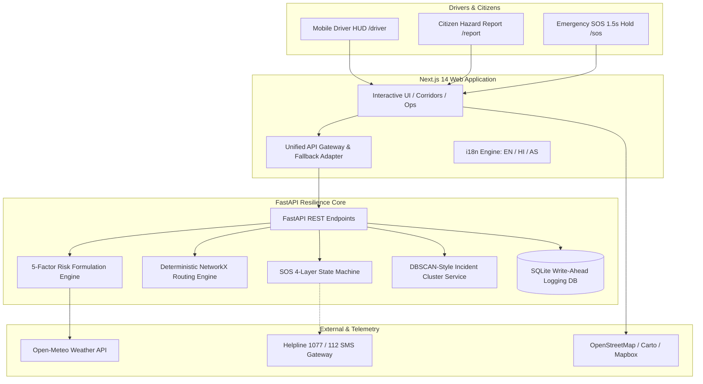

<div align="center">

# 🛣️ MargSetu (मार्गसेतु)
### AI-Based Smart Logistics & Accessibility Intelligence Platform for Northeast Region (NER)

**Smart India Hackathon 2026** | **Ministry of Development of North Eastern Region (MDoNER) & National Disaster Management Authority (NDMA)**

[](https://fastapi.tiangolo.com/)
[](https://nextjs.org/)
[](https://www.python.org/)
[](https://github.com/SHUBHJAIN139/MargSetu)
[](https://github.com/SHUBHJAIN139/MargSetu)
[](LICENSE)

*“Know which road is open before you leave.”*

</div>

---

## 📌 Executive Summary & Problem Context

Every monsoon season, northeastern India faces acute physical isolation. Critical arterial lifelines such as **NH-6 (Guwahati – Shillong – Silchar)** and **NH-27 (Guwahati – Nagaon – Haflong – Silchar)** suffer catastrophic disruptions caused by landslides, flash floods, and bridge washouts. Key bottleneck chokepoints like the **Sonapur Tunnel (25.1147°N, 92.3654°E)** in Meghalaya cut off the entire Barak Valley (Assam), Tripura, Mizoram, and parts of Manipur for days or weeks.

Standard commercial navigation apps (such as Google Maps) rely strictly on travel time and existing GPS velocity telemetry. When a mountain road suffers an active rockfall, commercial apps often divert heavy civilian convoys and supply trucks directly into deadly hazard zones before slow traffic updates register. Furthermore, deep mountain gorges frequently suffer **complete cellular blackouts**, rendering online navigation unusable.

**MargSetu** bridges this critical gap. It is an **offline-first, multi-tier logistics intelligence and emergency accessibility platform** engineered specifically for the terrain, monsoons, and infrastructure realities of Northeast India.

---

## 🌟 Key Features & Innovations

### 1. 📐 5-Factor Deterministic Risk Engine
Rather than relying on non-deterministic LLM hallucinations for routing, MargSetu implements an empirical mathematical hazard formulation:

$$R_i = 0.40 \cdot \text{Rainfall} + 0.30 \cdot \text{Slope} + 0.15 \cdot \text{Soil} + 0.10 \cdot \text{Crowd} + 0.05 \cdot \text{Historical}$$

- **Structural Veto Gate:** When localized rainfall exceeds 75 mm/h or verified structural blockages (landslides/bridge breaches) occur, the corridor triggers an immediate **Hard Veto ($R_i = 10.0$)**, barring civilian and supply traffic.
- **Dynamic Detour Trade-off Analytics:** Evaluates detours via NH-27 (Haflong Bypass) and calculates actionable trade-offs: $+42\text{ km}$, $+56\text{ min}$, but **$-99.2\%$ hazard exposure reduction**.

### 2. 🚨 4-Layer Failover SOS Emergency Cascade
Mountain logistics cannot rely on continuous 4G/5G connectivity. MargSetu provides a guaranteed 4-layer failover mechanism:
- **Anti-Panic Hold:** Requires a strict **1.5-second hold** to activate, preventing accidental triggers while driving over bumpy terrain.
- **Layer 1 (Live HTTP/WebSocket):** Transmits immediate telemetry to the NDMA Operations Console when online.
- **Layer 2 (Local Storage / WAL):** Caches emergency beacons locally if connection drops.
- **Layer 3 (Direct Telecom Hooks):** Fallback triggers OS-level direct emergency dialer and pre-formatted SMS to **State Disaster Helpline 1077** and **ERSS 112** with precise GPS coordinates.
- **Layer 4 (Simulated Mesh / LoRa Relay):** Beacon propagation across nearby vehicles in complete blackout environments.

### 3. 🛡️ NDMA Operations Console (`/ops`)
- **Real-Time Incident Triage:** Operator workflow to corroborate citizen hazard reports (`Acknowledge` $\rightarrow$ `Assign` $\rightarrow$ `Mark Resolved` $\rightarrow$ `False Positive`).
- **Live SOS Queue:** High-priority operator alert panel with audible siren cues and live coordinates.
- **Cluster Corroboration:** Prevents panic and fake reports by grouping duplicate nearby reports within a 5 km radius.
- **Strategic Airhead Advisories:** Automatically suggests air-drop staging coordinates (Guwahati GAU / Silchar IXS) when all terrestrial lifelines are severed.

### 4. 📱 Driver Emergency HUD (`/driver`)
- Ultra-lightweight, high-contrast **360px mobile view** built for one-handed operation.
- **Multilingual Support:** One-tap toggle between **English**, **Hindi (हिन्दी)**, and **Assamese (অসমীয়া)**.
- High-contrast road state visualization: Clear, Amber (Caution), Red (Blocked), and Purple (NDMA Emergency-Only Corridor).

### 5. 🏷️ Honesty-First Transparency Labels
MargSetu enforces strict integrity:
- Every data point displays an explicit origin tag: `LIVE API`, `VERIFIED STATIC`, `USER-SUBMITTED`, or `SIMULATION`.
- Guarantees zero exaggerated claims (e.g., status is labeled `Delivered to Ops`, never misleadingly marked as `Rescued`).

---

## 🏗️ System Architecture



---

## 📁 Repository Structure

```text
MargSetu/
├── backend/
│   ├── data/
│   │   ├── config.json              # Risk weights, seasonal modifiers & vehicle specs
│   │   ├── corridors.geojson        # Verified GIS geometries for C1, C2, and C3
│   │   └── scenario_reset.json      # Byte-identical baseline simulation dataset
│   ├── models/
│   │   └── schemas.py               # Pydantic v2 data models & validation schemas
│   ├── services/
│   │   ├── risk_service.py          # 5-factor mathematical risk calculator
│   │   ├── route_service.py         # NetworkX corridor graph & detour pathfinder
│   │   ├── sos_service.py           # 4-layer SOS cascade state machine
│   │   ├── report_service.py        # Spatial clustering & hazard verification
│   │   └── llm_service.py           # Gemini advisory generator + deterministic fallback
│   ├── tests/                       # 73 unit, integration & acceptance test suites
│   ├── database.py                  # SQLite WAL initialization & data seeding
│   ├── main.py                      # FastAPI application routing & CORS
│   ├── requirements.txt             # Python dependencies
│   └── .env.example                 # Sanitized backend environment template
├── frontend/
│   ├── app/
│   │   ├── page.jsx                 # Landing presentation & mission overview
│   │   ├── driver/                  # 360px mobile Driver Emergency HUD
│   │   ├── ops/                     # NDMA Command & Operations Console
│   │   ├── corridors/               # Interactive GIS corridor intelligence map
│   │   ├── report/                  # Citizen hazard reporting interface
│   │   └── sos/                     # Dedicated blackout SOS emergency relay
│   ├── components/                  # Modular React components (SOS, Maps, Ops, Nav)
│   ├── lib/
│   │   ├── adapters/                # Pluggable RealAdapter & MockAdapter
│   │   ├── api.js                   # Unified API gateway & fallback handler
│   │   └── i18n.js                  # English, Hindi & Assamese translations
│   ├── package.json                 # Node dependencies
│   └── .env.example                 # Sanitized frontend environment template
├── ARCHITECTURE.md                  # Comprehensive technical architecture document
├── MargSetu_Jury_QA_CheatSheet.md    # SIH Grand Finale jury defense cheat sheet
├── .gitignore                       # Production gitignore protecting secrets & builds
└── README.md                        # Master repository documentation
```

---

## 🚀 Quick Start Guide

### Prerequisites
- **Python**: Version 3.10 or higher
- **Node.js**: Version 18.x or higher (`npm` included)
- **Git**

---

### Step 1: Clone the Repository

```bash
git clone https://github.com/SHUBHJAIN139/MargSetu.git
cd MargSetu
```

---

### Step 2: Setup & Start the Backend

1. Navigate to the backend directory:
   ```bash
   cd backend
   ```
2. Create and activate a Python virtual environment:
   ```bash
   python3 -m venv venv
   source venv/bin/activate
   ```
3. Install dependencies:
   ```bash
   pip install -r requirements.txt
   ```
4. Configure environment variables (optional):
   ```bash
   cp .env.example .env
   ```
5. Run the test suite to verify system health (all 73 tests should pass):
   ```bash
   pytest tests
   ```
6. Start the FastAPI development server:
   ```bash
   uvicorn main:app --host 0.0.0.0 --port 8000 --reload
   ```
   - API Root: [http://localhost:8000](http://localhost:8000)
   - Interactive Swagger Docs: [http://localhost:8000/docs](http://localhost:8000/docs)

---

### Step 3: Setup & Start the Frontend

1. In a new terminal, navigate to the frontend directory:
   ```bash
   cd ../frontend
   ```
2. Install frontend dependencies:
   ```bash
   npm install
   ```
3. Configure environment variables:
   ```bash
   cp .env.example .env.local
   ```
4. Build and start the production server:
   ```bash
   npm run build
   npm start
   ```
   *(For development mode, run `npm run dev`)*

5. Open your browser and navigate to:
   - **Landing Page:** [http://localhost:3000](http://localhost:3000)
   - **Driver HUD (Mobile):** [http://localhost:3000/driver](http://localhost:3000/driver)
   - **NDMA Operations Console:** [http://localhost:3000/ops](http://localhost:3000/ops) *(PIN: `NDMA2026` or `1077`)*
   - **Corridor Map:** [http://localhost:3000/corridors](http://localhost:3000/corridors)
   - **Citizen Report:** [http://localhost:3000/report](http://localhost:3000/report)

---

## 🧪 Acceptance Criteria & Automated Testing

MargSetu has been rigorously tested against all 12 Smart India Hackathon operational acceptance criteria:

| Test Suite | Coverage | Status |
| :--- | :--- | :---: |
| `test_health.py` | Authority naming (NDMA only) & dual simulation disclaimers | ✅ PASSED |
| `test_risk_engine.py` | 5-factor mathematical weighting & Sonapur structural veto | ✅ PASSED |
| `test_routing.py` | Multi-alternative NetworkX pathfinding & detour trade-offs | ✅ PASSED |
| `test_sos_state_machine.py` | 4-layer SOS cascade, anti-panic 1.5s hold & zero false claims | ✅ PASSED |
| `test_clustering_reports.py`| Spatial DBSCAN clustering & citizen hazard corroboration | ✅ PASSED |
| `test_scenario_controls.py` | One-click byte-identical scenario reset | ✅ PASSED |
| `test_llm_service.py` | Gemini Flash advisory briefs + deterministic template fallback | ✅ PASSED |
| `Total Test Suite` | **73 Tests Across All Modules** | **100% PASSING** |

---

## 🔮 Future Scope & Production Roadmap (Post-Hackathon)

MargSetu is engineered not merely as a hackathon submission, but as a modular foundation for real-world disaster logistics and accessibility. The post-hackathon production deployment roadmap comprises five key expansion phases:

### 1. 📡 Physical LoRa & ESP32 Mesh Beacon Hardware ("MargSetu Pods")
- **Zero-Cellular Mountain Relays:** Deploy low-cost, solar-powered LoRaWAN relay nodes along extreme dead zones (such as the 35 km Sonapur gorge on NH-6).
- **Vehicle-to-Vehicle (V2V) Micro-Advisories:** Supply trucks equipped with low-cost USB dongles hop SOS beacons and road blockage packets peer-to-peer, relaying them to the nearest online outpost or toll plaza.

### 2. 🛰️ ISRO Bhuvan & Satellite SAR InSAR Integration
- **Interferometric Synthetic Aperture Radar (InSAR):** Integrate Sentinel-1 and upcoming NISAR / RISAT radar telemetry to measure millimeter-scale hillside ground deformation through dense monsoon cloud cover.
- **Predictive Slope Failure AI:** Move from *reactive rerouting* to *predictive pre-closure warnings* 48 to 72 hours before a landslide breaches the carriageway.

### 3. 🏗️ BRO & NHIDCL Geotechnical Sensor Telemetry
- Direct telemetry ingestion from slope inclinometers, pore-water piezometers, and acoustic emission sensors maintained by the **Border Roads Organisation (BRO)** and **NHIDCL** along critical bypasses.

### 4. 📞 Inclusive Voice & Low-Tech Citizen Access (Bhashini AI & USSD)
- **Zero-Data Accessibility:** Implement a USSD gateway (`*1077#`) allowing drivers on 2G feature phones to query open road status and report blocked routes via simple numeric menus.
- **Dialect Voice Bot:** Integrate **Bhashini AI** (National Language Translation Mission) for two-way automated voice advisories in Khasi, Garo, Mizo, Bodo, Sylheti, Bengali, and Assamese.

### 5. 🗺️ Pan-India Mountain Scalability
The modular corridor architecture can be deployed seamlessly across other disaster-vulnerable mountainous highways:
- **NH-44:** Jammu – Srinagar National Highway (Patnitop & Banihal landslide zones)
- **Char Dham All-Weather Route:** Rishikesh – Joshimath – Badrinath (Uttarakhand)
- **NH-5:** Hindustan – Tibet Road (Kinnaur, Himachal Pradesh)
- **Western Ghats:** Mumbai – Goa Highway & Konkan mountain passes

### 6. 📱 PWA Full-Offline Vector Tile Caching
- Upgrade the client frontend into a certified Progressive Web App (PWA) with persistent Service Worker storage for offline vector map tiles (MBTiles / Protobuf), guaranteeing complete offline turn-by-turn navigation even when fully air-gapped.

---

## ⚠️ Honesty & Simulation Notice

> **NDMA Prototype Notice:**  
> MargSetu is an educational research and competition demonstration prototype developed for **Smart India Hackathon 2026**.  
> **SIMULATION — Not connected to live official NDMA dispatch systems.**  
> In an actual life-threatening disaster or road emergency, citizens must dial the official National Emergency Number **112** or State Disaster Helpline **1077**.

---

## 👥 Authors & Team

Developed with ❤️ for the resilience and safety of the North Eastern Region of India.

- **GitHub:** [@SHUBHJAIN139](https://github.com/SHUBHJAIN139)
- **Repository:** [https://github.com/SHUBHJAIN139/MargSetu](https://github.com/SHUBHJAIN139/MargSetu)
- **Event:** Smart India Hackathon (SIH) 2026

---

## 📄 License

This project is licensed under the MIT License — see the [LICENSE](LICENSE) file for details.
